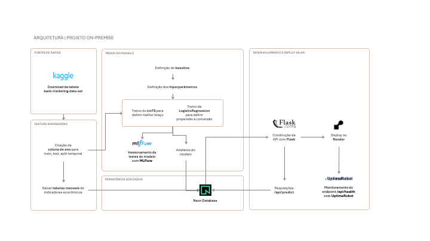

# Plataforma de recomendação adaptativa em canais digitais com abordagem Multi-Armed Bandit

*Tech Challenge da Fase 5 do curso de [pós-graduação em Engenharia de Machine Learning FIAP](https://postech.fiap.com.br/curso/machine-learning-engineering/)*

**Link para a aplicação / API:** https://financial-ml-decisioning.onrender.com/
> *📽️ Vídeo com demonstração técnica do projeto (em breve)*

## 🎯 1. Sobre o projeto
O projeto tem como objetivo construir uma plataforma de experimentação adaptativa para ofertas, mensagens ou próximos passos em canais digitais para uma empresa de segmento financeiro usando [Multi-Armed Bandit](docs/multi_armed_bandit.md).

A ideia é decidir, em diferentes canais, qual oferta, mensagem ou próximo passo apresentar para cada cliente elegível.

> ### 🎲 Fontes de dados

Os dados utilizados neste projeto foram dispolibilizados pelo perfil do usuário [tunguz](https://www.kaggle.com/tunguz) no site do Kaggle: [Bank Marketing Data Set](https://www.kaggle.com/datasets/tunguz/bank-marketing-data-set)

É uma tabela derivada do estudo publicado no artigo [A data-driven approach to predict the success of bank telemarketing](https://sci-hub.box/10.1016/j.dss.2014.03.001), de Moro at al., 2014.

- São dados de campanhas diretas de marketing (por telefone) de uma instituição bancária portuguesa.
- A tabela tem 41.188 linhas e 21 colunas, sendo que a última informa se o cliente contratou o produto (term depoist), pode ser yes ou no.
- Não há identificação dos clientes, apenas dados de perfil, de data, dados da campanha e dados econômicos do momento da ligação.
- Os dados variam entre maio/2008 e novembro/2010 e estão ordenados por data (apenas mês e dia da semana)

A análise exploratória está disponível no notebook [1_eda.ipynb](notebooks/eda.ipynb)

**Observações: Como a base utilizada não registra qual oferta foi apresentada, o reward usado no protótipo será a conversão do produto (term deposit).**

> ### 🦾 Definições do bandit

**Features utilizadas**

| Tipo | Feature |
| --- | --- |
| Perfil | Idade<br>Faixa etária<br>Profissão<br>Estado civil<br>Escolaridade|
| Crédito | Se tem financiamento imobiliário<br>Se tem empréstimo pessoal|
| Data | Mês<br>Dia da semana|
| Campanhas anteriores | Quantos contatos teve em campanhas anteriores<br>Resultado da campanha anterior (sucesso, falha ou não existente)|
| Indicadores econômicos | Consumer confidence index (indicador mensal)<br>Consumer price index (indicador mensal)<br>Employment variation rate (indicador trimestral)<br>Euribor 3 month rate (indicador diário)<br>Number of employees (indicador trimestral)|

**Variáveis removidas da tabela original**
- **campaign**: não faz sentido usar a quantidade de contatos durante a campanha porque isso não necessariamente será usado ao fazer o predict
- **duration**: não tem como saber qual será a duração da ligação ao fazer o contato
- **pdays**: a maioria é 999 (equivalente a null)
- **default** (se tem crédito por padrão): apenas 3 estão como yes, o resto é no ou unknown
- **year**: se fazemos split temporal, não faz sentido usar o ano (os anos da fração de teste não estarão na fração de treino)

**Braços**
1. **Braço 1:** oferecer term deposit via celular
2. **Braço 2:** oferecer term deposit via telefone

**Reward** (coluna 'y')
- **yes**: conversão
- **no**: não conversão

> ### 📈 Resultados do modelo

> Em breve

## ⚙️ 2. Etapas e funcionalidades

- Download, leitura e pré-processamento dos dados
- Treino do modelo
    - Definição do baseline
    - Definição de hiperparâmetros do modelo LinTS
    - Treino do modelo LinTS
    - Treino da LogisticRegression para calcular a probabilidade de conversão
    - Criação do Golden Set (exemplos diversos para demonstração da recomendação)
- Uso da ferramenta de versionamento MLFlow localmente
    - Instalação e configuração do MLFlow
    - Registro das métricas 
    - Registro a versão do modelo/política utilizada
- Uso do banco de dados Neon Database
    - Criação de uma conta e de um projeto com object storage
    - Persistência dos artefatos do modelo e tabelas auxiliares de valores de indicadores econômicos para servir os dados através da API
    - Registro dos predicts feitos através de requisições da API
- Desenvolvimento da API
    - Receber dados de um cliente/contexto
    - Gerar a recomendação de braço/oferta
    - Retornar a oferta recomendada
    - Criação de interface para receber inputs do usuário e retornar outputs de recomendação
    - Deploy no render e monitoramento do health com UptimeRobot

## 📐 3. Arquitetura

A arquitetura do projeto como foi construído (on-premise) pode ser observada no diagrama abaixo



Se o projeto fosse colocado no ar usando os serviços da AWS, seriam utilizados os seguintes recursos:

- Na etapa de fontes de dados e feature engineering, o dataset baixado do Kaggle poderia ser armazenado em um bucket do **Amazon S3,** que funcionaria como data lake bruto (camada raw) e, após o processamento, também guardaria as tabelas mensais de indicadores econômicos e a base já tratada (camada trusted). 

- O processamento de criação da coluna de ano e da divisão temporal do train_test_split poderia ser feito em notebooks ou jobs do **Amazon SageMaker Processing** (ou, para um pipeline mais leve, em uma função **AWS Lambda** ou em um job do **AWS Glue**), lendo os dados diretamente do **S3** e regravando as tabelas processadas também no **S3**. 

- Já a etapa de treino do modelo — definição de baseline, hiperparâmetros, treino do LinTS e da LogisticRegression — seria natural no **Amazon SageMaker Training**, que permite rodar os treinos em instâncias gerenciadas, versionar os experimentos e, combinado ao **SageMaker Model Registry**, substituir ou complementar o papel do MLflow no versionamento dos artefatos do modelo.

- Para a persistência dos dados, o Neon Database poderia ser substituído por um banco gerenciado na AWS, como o **Amazon RDS for PostgreSQL** (equivalente relacional direto) ou o **Amazon DynamoDB**, caso o padrão de acesso aos artefatos e predições fosse mais simples e orientado a chave-valor.

- Os artefatos do modelo (pesos, preprocessador, bandit) continuariam também versionados no **S3**, com o banco guardando metadados e resultados das predições. 

- Na etapa de desenvolvimento e deploy da API, a aplicação Flask poderia ser empacotada em contêiner e implantada no **Amazon ECS** (Fargate) ou no **AWS App Runner**, com o tráfego exposto por um **Application Load Balancer** e, opcionalmente, o **Amazon API Gateway** na frente para gerenciar os endpoints /api/predict e /api/health. 

- O monitoramento, hoje feito pelo UptimeRobot, seria coberto pelo **Amazon CloudWatch** (métricas, logs e alarmes de saúde do serviço) combinado a checagens periódicas via **CloudWatch Synthetics** ou **Route 53 Health Checks**, mantendo a mesma função de verificar continuamente a disponibilidade do endpoint de saúde da API.


## 📁 4. Estrutura do projeto

```
financial-ml-decisioning
├── data/                                           # dados brutos e tratados (ignorado)
│   ├── raw/
│   │   └── bank-marketing-data-set
│   ├── trusted/
│   │   ├── cons_conf_idx_mensal.parquet
│   │   ├── cons_price_idx_mensal.parquet
│   │   ├── emp_var_rate_mensal.parquet
│   │   ├── euribor3m_mensal.parquet
│   │   ├── nr_employed_mensal.parquet
│   │   └── tabela_analitica.parquet
│   └── refined/
├── diagrams/                                       # diagramas arquiteturais
│   └── arquitetura.png
├── docs/                                           # arquivos de documentação
│   ├── multi_armed_bandit.md
│   ├── config_neon_db.md
│   └── config_mlflow.md
├── mlops/                                          # arquivos de configuração do MLFlow
│   ├── artifacts/
│   ├── __init__.py
│   ├── mlflow.db
│   ├── start_mlflow.sh
│   └── tracking.py
├── models/                                         # artefatos dos modelos treinados (arquivos para inferência, metadados e resultados)
│   ├── results/
│   │   ├── avaliacao_lints_test.csv
│   │   ├── baseline3_classificacao.csv
│   │   ├── comparacao_politicas.csv
│   │   ├── comparacao_por_braco.csv
│   │   ├── comparacao_por_segmento.csv
│   │   ├── metricas_lints.csv
│   │   ├── metricas_reward_models.csv
│   │   ├── tuning_runs_lints.csv
│   │   └── tuning_summary_lints.csv
│   ├── lints_bundle.joblib
│   ├── lints_features.csv
│   ├── lints_metadata.json
│   ├── lints_model.joblib
│   ├── preprocessor.joblib
│   └── reward_models.joblib
├── notebooks/                                      # EDA, treino do modelo e golden set
│   ├── 1_eda.ipynb
│   ├── 2_feature_eng.ipynb
│   ├── 3_model_train.ipynb
│   ├── 4_golden_set.ipynb
│   ├── 5_upload_indicators_neon.ipynb
│   └── 6_teste_api_prod.ipynb
├── src/                                            # criação da API, interface da aplicação e configuração do neon database
│   ├── api/
│   │   ├── api_endpoints.py
│   │   ├── home_backend.py
│   │   └── predict_log.py
│   ├── config/
│   │   ├── __init__.py
│   │   └── neon.py
│   ├── static/
│   │   ├── favicon.svg
│   │   ├── github.svg
│   │   └── swagger.svg
│   ├── templates/
│   │   └── home.html
│   ├── __init__.py
│   └── utils_eda.py
├── tests/                                          # notebooks de teste (não vai para repositório remoto)
│   ├── data_selection.ipynb
│   ├── get_folder_tree.ipynb
│   └── teste_neon.ipynb
├── .env                                            # arquivo com as keys de conexão com o banco (ignorado)
├── .gitignore
├── .neon                                           # credenciais do projeto (ignorado)
├── .python-version                                 # versão do python para render
├── create_table_requests.py                        # criar a tabela no neon para registrar uso do endpoint /predict
├── main.py                                         # arquivo principal da aplicação
├── neon.ts                                         # configuração do neon
├── package-lock.json                               # configuração do neon (ignorado)
├── package.json                                    # configuração do neon
├── README.md
└── requirements.txt                                # libs necessárias para rodar o projeto
```

## 🛠️ 5. Instruções de execução

### Requisitos:
- Python 3.11 instalado

### 5.1 Configurar ambiente virtual

- Criar ambiente virtual

```
# se windows:
python -m venv .venv

# se mac ou linux:
python3.11 -m venv .venv
```

- Ativar ambiente virtual

```
# windows
.venv\Scripts\Activate.ps1

# mac ou linux
source .venv/bin/activate
```

- Instalar dependências

```
# windows
pip install -r requirements.txt

# mac ou linux
pip3 install -r requirements.txt
```

- Criar ipykernel para usar o .venv criado nos notebooks

```
# windows
python -m ipykernel install --user --name=venv-decisioning --display-name="Python (venv-decisioning)"

# mac ou linux
python3 -m ipykernel install --user --name=venv-decisioning --display-name="Python (venv-decisioning)"
```

### 5.2 Reproduzir feature engineering nos dados do Kaggle

Passos disponíveis no notebook [2_feature_eng.ipynb](notebooks/6_teste_api_prod.ipynb)

### 5.3 Usar API localmente

Passos disponíveis no notebook [6_teste_api_prod.ipynb](notebooks/6_teste_api_prod.ipynb)

### 5.4 Acessar Swagger

A documentação dos endpoints da API está disponível em https://financial-ml-decisioning.onrender.com/docs/

### 5.5 Configurar Neon Database

As instruções de configuração do Neon Database estão disponíveis em [config_neon_db.md](docs/config_neon_db.md)

### 5.6 Configurar MLFlow

As instruções de configuração do MLFlow estão disponíveis em [config_mlflow.md](docs/config_mlflow.md)

## 🚀 6. Evolução do projeto

Limitações do projeto:
- A base utilizada não registra qual oferta foi apresentada, então a avaliação de um bandit precisa explicitar como os "braços" serão definidos e como o reward será observado ou simulado
- A base tem dados muito antigos (2008 a 2010), e os indicadores econômicos mudaram muito desde então. Seria necessário usar uma tabela mais atual para previsões mais precisas para os dias de hoje
- A base não tem todos os meses de todos os anos e o volume de observações varia ao longo dos meses

Ideias para **refinamento do modelo**:
- Usar uma base de dados mais robusta (como explicado na parte de "Observações" da seção Fontes de dados)
- Implementar logging e monitoramento de decisões
- Criar experimento A/B ou contextual bandit real para coletar dados de novas ofertas
- Usar braços de comunicação e oferta, como: abordagem padrão, abordagem personalizada por perfil, abordagem de follow-up, variações de mensagem/argumentação comercial
- Evoluir de conversão binária para reward econômico, considerando valor da contratação e eventual custo da ação
- Exploração mais exaustiva do conjunto de variáveis utiizadas e hiperparâmetros para melhorar a performance

Ideias para **refinamento de infraestrutura**:
- Implementar o projeto em uma cloud (AWS por exemplo)
- Criar processo de retreinamento/atualização automática
- Monitorar drift dos dados e alteração do comportamento por período
- Criar uma tabela para registrar todas as requisições de todos os endpoints
- Explorar mais a ferramenta MLFlow para versionamento