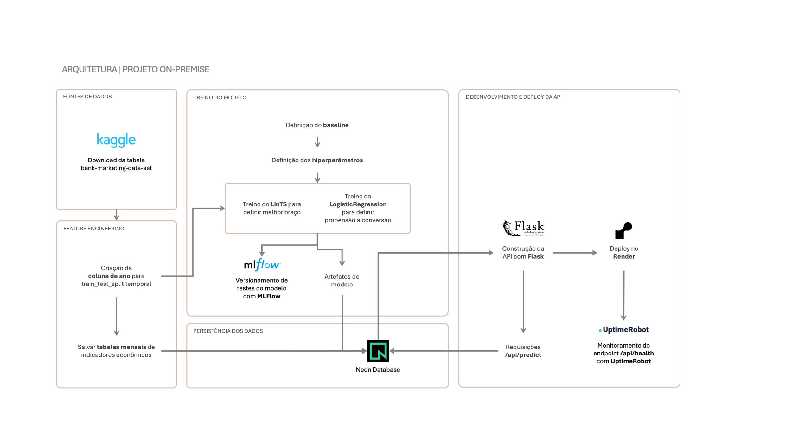
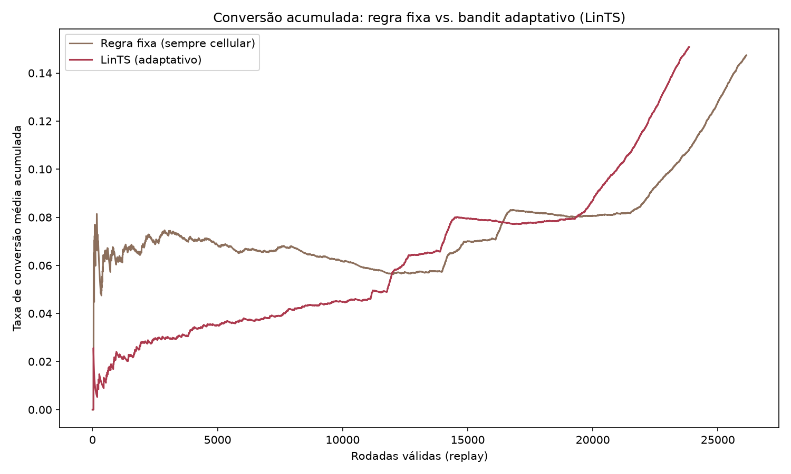

# Plataforma de recomendação adaptativa em canais digitais com abordagem Multi-Armed Bandit

*Tech Challenge da Fase 5 do curso de [pós-graduação em Engenharia de Machine Learning FIAP](https://postech.fiap.com.br/curso/machine-learning-engineering/)*

**Link para a aplicação / API:** https://financial-ml-decisioning.onrender.com/
> *📽️ Vídeo com demonstração técnica do projeto (em breve)*

## 🎯 1. Sobre o projeto

O projeto tem como objetivo construir uma plataforma de experimentação adaptativa para ofertas por diferentes canais para uma empresa de segmento financeiro usando [Multi-Armed Bandit](docs/multi_armed_bandit.md).

> ### 🎲 Fontes de dados

Os dados utilizados neste projeto são provenientes do Kaggle: [Bank Marketing Data Set](https://www.kaggle.com/datasets/tunguz/bank-marketing-data-set)

É uma tabela derivada do estudo publicado no artigo A data-driven approach to predict the success of bank telemarketing de Moro *et al.*, 2014.

- São dados de campanhas diretas de marketing (por telefone) de uma instituição bancária portuguesa.
- A tabela tem 41.188 linhas e 21 colunas, sendo que a última informa se o cliente contratou o produto (term deposit), pode ser yes ou no.
- Não há identificação dos clientes, apenas dados de perfil, de data, dados da campanha e dados econômicos do momento da ligação.
- Os dados variam entre maio/2008 e novembro/2010 e estão ordenados por data (apenas mês e dia da semana)

A análise exploratória está disponível no notebook [1_eda.ipynb](notebooks/1_eda.ipynb).

**Limitações da tabela utilizada**:
- Como a base utilizada não registra qual oferta foi apresentada, o reward usado no protótipo será a conversão do produto (term deposit)
- Para cada cliente, temos apenas 1 forma de contato, então não é possível comparar diferentes canais para uma mesma pessoa

> ### 🦾 Definições do bandit

**Features utilizadas**

| Tipo | Feature |
| --- | --- |
| Perfil | Idade<br>Faixa etária<br>Profissão<br>Estado civil<br>Escolaridade|
| Crédito | Se tem financiamento imobiliário<br>Se tem empréstimo pessoal|
| Data | Mês<br>Dia da semana|
| Campanhas anteriores | Quantos contatos teve em campanhas anteriores<br>Resultado da campanha anterior (sucesso, falha ou não existente)|
| Indicadores econômicos | Consumer confidence index (indicador mensal)<br>Consumer price index (indicador mensal)<br>Employment variation rate (indicador trimestral)<br>Euribor 3 month rate (indicador diário)<br>Number of employees (indicador trimestral)|

**Variáveis removidas da tabela original**
- **campaign**: não faz sentido usar a quantidade de contatos durante a campanha porque isso não necessariamente será usado ao fazer o predict
- **duration**: não tem como saber qual será a duração da ligação ao fazer o contato
- **pdays**: a maioria é 999 (equivalente a null)
- **default** (se tem crédito por padrão): apenas 3 estão como yes, o resto é no ou unknown
- **year**: se fazemos split temporal, não faz sentido usar o ano (os anos da fração de teste não estarão na fração de treino)

**Braços**
1. **Braço 1:** oferecer term deposit via celular
2. **Braço 2:** oferecer term deposit via telefone

**Reward** (coluna 'y')
- **yes**: conversão
- **no**: não

**Baseline**
Oferecer o produto para todos que tem uma dessas características:
- Mais de 60 anos
- Até 25 anos
- Aposentado
- Estudante
- Contratou na campanha anterior

## 📐 2. Arquitetura

A arquitetura do projeto como foi construído (on-premise) pode ser observada no diagrama abaixo



Se o projeto fosse colocado no ar usando os serviços da AWS, seriam utilizados os seguintes recursos:

- Na etapa de fontes de dados e feature engineering, o dataset baixado do Kaggle poderia ser armazenado em um bucket do **Amazon S3,** que funcionaria como data lake bruto (camada raw) e, após o processamento, também guardaria as tabelas mensais de indicadores econômicos e a base já tratada (camada trusted).

- O processamento de criação da coluna de ano e da divisão temporal do train_test_split poderia ser feito em notebooks ou jobs do **Amazon SageMaker Processing** (ou, para um pipeline mais leve, em uma função **AWS Lambda** ou em um job do **AWS Glue**), lendo os dados diretamente do **S3** e regravando as tabelas processadas também no **S3**.

- Já a etapa de treino do modelo — definição de baseline, hiperparâmetros, treino do LinTS e da LogisticRegression — seria natural no **Amazon SageMaker Training**, que permite rodar os treinos em instâncias gerenciadas, versionar os experimentos e, combinado ao **SageMaker Model Registry**, substituir ou complementar o papel do MLflow no versionamento dos artefatos do modelo.

- Para a persistência dos dados, o Neon Database poderia ser substituído por um banco gerenciado na AWS, como o **Amazon RDS for PostgreSQL** (equivalente relacional direto) ou o **Amazon DynamoDB**, caso o padrão de acesso aos artefatos e predições fosse mais simples e orientado a chave-valor.

- Os artefatos do modelo (pesos, preprocessador, bandit) continuariam também versionados no **S3**, com o banco guardando metadados e resultados das predições.

- Na etapa de desenvolvimento e deploy da API, a aplicação Flask poderia ser empacotada em contêiner e implantada no **Amazon ECS** (Fargate) ou no **AWS App Runner**, com o tráfego exposto por um **Application Load Balancer** e, opcionalmente, o **Amazon API Gateway** na frente para gerenciar os endpoints /api/predict e /api/health.

- O monitoramento, hoje feito pelo UptimeRobot, seria coberto pelo **Amazon CloudWatch** (métricas, logs e alarmes de saúde do serviço) combinado a checagens periódicas via **CloudWatch Synthetics** ou **Route 53 Health Checks**, mantendo a mesma função de verificar continuamente a disponibilidade do endpoint de saúde da API.

## ⚙️ 3. Funcionalidades

**Etapas principais**
- Download, leitura e pré-processamento dos dados
- Treino do modelo
    - Definição do baseline
    - Definição de hiperparâmetros do modelo LinTS
    - Treino do modelo LinTS
    - Treino da LogisticRegression para calcular a probabilidade de conversão
    - Criação do Golden Set (exemplos diversos para demonstração da recomendação)
- Uso do banco de dados Neon Database
    - Criação de uma conta e de um projeto com object storage
    - Persistência dos artefatos do modelo e tabelas auxiliares de valores de indicadores econômicos para servir os dados através da API
    - Registro dos predicts feitos através de requisições da API
- Desenvolvimento da API
    - Receber dados de um cliente/contexto
    - Gerar a recomendação de braço/oferta
    - Retornar a oferta recomendada
    - Criação de interface para receber inputs do usuário e retornar outputs de recomendação
    - Deploy no Render e monitoramento do health com UptimeRobot

**Uso do MLflow (localmente)**

O versionamento e o rastreamento dos experimentos são feitos com **MLflow**, rodando localmente. Cada execução de treino registra:
- os hiperparâmetros testados e escolhidos (alpha e l2_lambda do LinTS);
- as métricas de avaliação (reward estimado, lift, match rate, e as métricas de classificação dos modelos de recompensa);
- os artefatos gerados (bundle do modelo, preprocessador, metadados e as tabelas de comparação).

As instruções de instalação e configuração estão em [config_mlflow.md](docs/config_mlflow.md), e o passo a passo do registro dos experimentos pode ser visto no notebook [3_model_train.ipynb](notebooks/3_model_train.ipynb), na seção "Tracking MLFlow".


## ⚙️ 4. Estrutura do projeto

```
financial-ml-decisioning
├── data/                                           # dados brutos e tratados (ignorado)
│   ├── raw/
│   │   └── bank-marketing-data-set
│   ├── trusted/
│   │   ├── cons_conf_idx_mensal.parquet
│   │   ├── cons_price_idx_mensal.parquet
│   │   ├── emp_var_rate_mensal.parquet
│   │   ├── euribor3m_mensal.parquet
│   │   ├── nr_employed_mensal.parquet
│   │   └── tabela_analitica.parquet
│   └── refined/
├── diagrams/                                       # diagramas arquiteturais
│   └── arquitetura.png
├── docs/                                           # arquivos de documentação
│   ├── multi_armed_bandit.md
│   ├── config_neon_db.md
│   └── config_mlflow.md
├── mlops/                                          # arquivos de configuração do MLFlow
│   ├── artifacts/
│   ├── __init__.py
│   ├── mlflow.db
│   ├── start_mlflow.sh
│   └── tracking.py
├── models/                                         # artefatos dos modelos treinados (arquivos para inferência, metadados e resultados)
│   ├── results/
│   │   ├── avaliacao_lints_test.csv
│   │   ├── baseline3_classificacao.csv
│   │   ├── comparacao_politicas.csv
│   │   ├── comparacao_por_braco.csv
│   │   ├── comparacao_por_segmento.csv
│   │   ├── metricas_lints.csv
│   │   ├── metricas_reward_models.csv
│   │   ├── tuning_runs_lints.csv
│   │   └── tuning_summary_lints.csv
│   ├── lints_bundle.joblib
│   ├── lints_features.csv
│   ├── lints_metadata.json
│   ├── lints_model.joblib
│   ├── preprocessor.joblib
│   └── reward_models.joblib
├── notebooks/                                      # EDA, treino do modelo e golden set
│   ├── 1_eda.ipynb
│   ├── 2_feature_eng.ipynb
│   ├── 3_model_train.ipynb
│   ├── 4_golden_set.ipynb
│   ├── 5_upload_indicators_neon.ipynb
│   └── 6_teste_api_prod.ipynb
├── src/                                            # criação da API, interface da aplicação e configuração do neon database
│   ├── api/
│   │   ├── api_endpoints.py
│   │   ├── home_backend.py
│   │   └── predict_log.py
│   ├── config/
│   │   ├── __init__.py
│   │   └── neon.py
│   ├── static/
│   │   ├── favicon.svg
│   │   ├── github.svg
│   │   └── swagger.svg
│   ├── templates/
│   │   └── home.html
│   ├── __init__.py
│   └── utils_eda.py
├── tests/                                          # notebooks de teste (não vai para repositório remoto)
│   ├── data_selection.ipynb
│   ├── get_folder_tree.ipynb
│   └── teste_neon.ipynb
├── .env                                            # arquivo com as keys de conexão com o banco (ignorado)
├── .gitignore
├── .neon                                           # credenciais do projeto (ignorado)
├── .python-version                                 # versão do python para render
├── create_table_requests.py                        # criar a tabela no neon para registrar uso do endpoint /predict
├── main.py                                         # arquivo principal da aplicação
├── neon.ts                                         # configuração do neon
├── package-lock.json                               # configuração do neon (ignorado)
├── package.json                                    # configuração do neon
├── README.md
└── requirements.txt                                # libs necessárias para rodar o projeto
```

## 📈 5. Resultados do modelo e Golden Set

A política adaptativa (contextual bandit com Thompson Sampling linear) foi comparada a uma regra fixa que sempre oferece o braço de melhor conversão histórica (`cellular`), usando o método de replay não-enviesado (*Unbiased Offline Evaluation of Contextual-bandit-based News Article Recommendation Algorithms*, Li *et al.*, 2011): o histórico é percorrido em ordem cronológica e cada rodada só é contabilizada — para ambas as políticas — quando a ação escolhida coincide com a ação de fato registrada nos dados.



A curva mostra o bandit adaptativo ultrapassando a regra fixa em alguns trechos do período, mas na maior parte do tempo sua conversão acumulada fica abaixo do baseline. Parte disso reflete uma mudança de regime entre os anos usados:
- em 2008 (treino) a conversão geral é de apenas 4,8%, com os canais quase empatados (50,5% cellular / 49,5% telephone);
- em 2009 (validação) a conversão sobe para 19,5%, já concentrada em cellular (91,8%);
- e em 2010 (teste) a conversão salta para 52,1%, com cellular em 81,1% dos contatos.

Como o bandit aprende a política com base no regime de baixa conversão de 2008–2009, ele carrega hipóteses que não se ajustam rapidamente ao salto de conversão observado em 2010. Como o método de replay só conta rodadas em que a recomendação do bandit coincide com a ação de fato registrada, os períodos em que `cellular` já dominava o histórico acabam favorecendo naturalmente a regra fixa nessa comparação. Isso indica não-estacionariedade na base (provável mudança de estratégia de campanha ao longo dos anos), e não necessariamente uma limitação do algoritmo em si.

Os modelos auxiliares de recompensa (regressão logística por braço) também trazem sinais mistos frente ao baseline:
- o modelo do braço `cellular` supera bastante o baseline em recall (93,6% contra 62,4%), ao custo de uma precisão um pouco menor (58,8% contra 63,6%); ou seja, erra para menos clientes convertidos, mas com mais falsos positivos.
- já o modelo do braço `telephone` tem o padrão oposto: precisão levemente melhor que o baseline (65,2% contra 63,6%), mas recall bem mais baixo (27,3% contra 62,4%), sendo mais conservador na hora de recomendar esse canal.

Portanto, a regressão logística supera o baseline nas duas métricas simultaneamente; o ganho existe, mas é específico de cada braço, e é justamente essa especialização por contexto que o bandit tenta explorar.

A base usada neste projeto tem uma limitação estrutural: para cada cliente, o histórico só contém o resultado do canal efetivamente utilizado na campanha original, sem informação sobre o que teria acontecido caso o outro canal tivesse sido escolhido. Isso é um cenário clássico de "logged bandit feedback": em vez de executar um experimento com exploração simultânea entre braços, o que temos são dados observacionais de uma única política.

Isso restringe a avaliação offline a métodos indiretos, como replay (que descarta boa parte do histórico para evitar viés) e estimativa via modelo de recompensa, ambos com limitações conhecidas. Um cenário mais adequado para demonstrar o ganho de uma abordagem adaptativa exigiria dados de um teste com alocação simultânea entre canais (ou o próprio bandit rodando em produção, escolhendo o canal para novos clientes), permitindo uma comparação causal mais direta entre a política fixa e a adaptativa.

**Golden Set**

O Golden Set é um conjunto curado de exemplos de clientes com perfis variados, usado para demonstrar de forma didática o comportamento da recomendação (braço escolhido + probabilidade de conversão) em diferentes cenários, sem depender de uma amostra aleatória do teste. É especialmente útil para o pitch e para checagens rápidas de sanidade do modelo, já que evidencia recomendações contrastantes para perfis de clientes bem distintos.

Está disponível no notebook [4_golden_set.ipynb](notebooks/4_golden_set.ipynb)

## 🛠️ 6. Instruções de execução

### Requisitos:
- Python 3.11 instalado

### 6.1 Configurar ambiente virtual

- Criar ambiente virtual

```
# se windows:
python -m venv .venv

# se mac ou linux:
python3.11 -m venv .venv
```

- Ativar ambiente virtual

```
# windows
.venv\Scripts\Activate.ps1

# mac ou linux
source .venv/bin/activate
```

- Instalar dependências

```
# windows
pip install -r requirements.txt

# mac ou linux
pip3 install -r requirements.txt
```

- Criar ipykernel para usar o .venv criado nos notebooks

```
# windows
python -m ipykernel install --user --name=venv-decisioning --display-name="Python (venv-decisioning)"

# mac ou linux
python3 -m ipykernel install --user --name=venv-decisioning --display-name="Python (venv-decisioning)"
```

### 6.2 Reproduzir feature engineering nos dados do Kaggle

Passos disponíveis no notebook [2_feature_eng.ipynb](notebooks/2_feature_eng.ipynb)

### 6.3 Usar API localmente

Passos disponíveis no notebook [6_teste_api_prod.ipynb](notebooks/6_teste_api_prod.ipynb)

### 6.4 Acessar Swagger

A documentação dos endpoints da API está disponível em https://financial-ml-decisioning.onrender.com/docs/

### 6.5 Configurar Neon Database

As instruções de configuração do Neon Database estão disponíveis em [config_neon_db.md](docs/config_neon_db.md)

### 6.6 Configurar MLFlow

As instruções de configuração do MLFlow estão disponíveis em [config_mlflow.md](docs/config_mlflow.md)

## 🚀 7. Evolução do projeto

Limitações do projeto:
- A base utilizada não registra qual oferta foi apresentada, então a avaliação de um bandit precisa explicitar como os "braços" serão definidos e como o reward será observado ou simulado
- A base tem dados muito antigos (2008 a 2010), e os indicadores econômicos mudaram muito desde então. Seria necessário usar uma tabela mais atual para previsões mais precisas para os dias de hoje
- A base não tem todos os meses de todos os anos e o volume de observações varia ao longo dos meses

Ideias para **refinamento do modelo**:
- Usar uma base de dados mais robusta (como explicado na parte de "Observações" da seção Fontes de dados)
- Implementar logging e monitoramento de decisões
- Criar experimento A/B ou contextual bandit real para coletar dados de novas ofertas
- Usar braços de comunicação e oferta, como: abordagem padrão, abordagem personalizada por perfil, abordagem de follow-up, variações de mensagem/argumentação comercial
- Evoluir de conversão binária para reward econômico, considerando valor da contratação e eventual custo da ação
- Exploração mais exaustiva do conjunto de variáveis utiizadas e hiperparâmetros para melhorar a performance

Ideias para **refinamento de infraestrutura**:
- Implementar o projeto em uma cloud (AWS por exemplo)
- Criar processo de retreinamento/atualização automática
- Monitorar drift dos dados e alteração do comportamento por período
- Criar uma tabela para registrar todas as requisições de todos os endpoints
- Explorar mais a ferramenta MLFlow para versionamento
